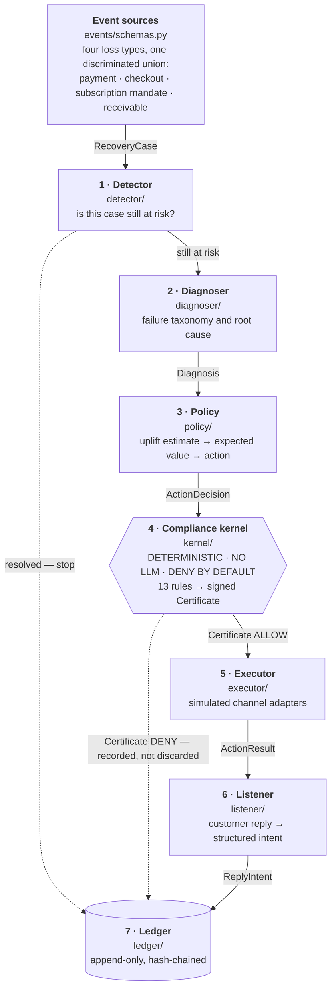
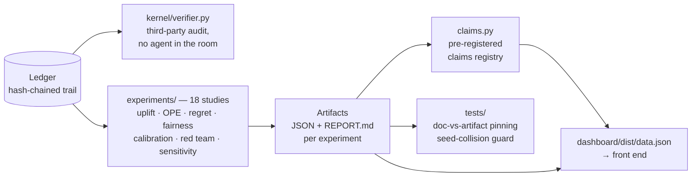

# Architecture

Recovery Ledger decides **whether** to contact a customer about a failed
payment, proves it was allowed to, and measures what that decision was worth
against a randomised no-contact holdout.

Three properties drive every structural choice in this document:

- **Deny by default.** No action executes without a signed certificate, and
  that is enforced by types, not by convention.
- **Determinism where it matters.** The compliance kernel is a pure predicate
  over structured state. Same input, same verdict, forever.
- **Every number has an artifact.** Claims are pre-registered and checked
  against the files that produced them, so the documentation cannot drift
  away from the code.

**Contents**

1. [The runtime loop](#1-the-runtime-loop)
2. [Module map](#2-module-map)
3. [Component contracts](#3-component-contracts)
4. [The compliance kernel](#4-the-compliance-kernel)
5. [The measurement layer](#5-the-measurement-layer)
6. [Design decisions](#6-design-decisions)
7. [Where the LLM is, and is not](#7-where-the-llm-is-and-is-not)
8. [Test strategy](#8-test-strategy)

---

## 1. The runtime loop

One case flows through seven stages. The kernel sits between the decision and
the action, and nothing routes around it.

**Orchestration.** `agent/loop.py` runs stages 1 through 7 for a single case
and returns a `CaseOutcome`. `agent/runner.py` drives a batch: it owns the
simulated clock, collects cases that paused rather than terminated, advances
time to the earliest resumption, and re-runs those that are due.

**Denials are evidence.** A DENY is written to the ledger exactly like an
ALLOW. An audit trail that only records what happened cannot answer the
question a regulator actually asks, which is what was refused and why.

---

## 2. Module map

Everything under `src/recovery_ledger/`.

### Runtime path

| Path | Responsibility |
|---|---|
| `events/schemas.py` | The four loss types as one discriminated union |
| `events/actions.py` · `events/outcomes.py` | Action vocabulary; `StopReason` (11 members) |
| `detector/detector.py` | Is this case still recoverable? |
| `detector/fleet.py` | Fleet-level issuer degradation detection (spec §8.4, novelty claim N6) |
| `diagnoser/diagnoser.py` | Failure taxonomy and root cause |
| `policy/decision.py` | Expected-value decision and the stop reason that explains it |
| `policy/features.py` | Case → numeric feature vector, shared by the uplift learner and the EV model |
| `policy/churn.py` | The `λ_churn × P(churn) × LTV` term of the EV equation |
| `policy/exploration.py` | Randomised exploration, so tomorrow's policy is evaluable from today's logs |
| `executor/executor.py` | Simulated channel adapters; accepts a `Certificate`, nothing else |
| `listener/listener.py` · `llm_listener.py` | Reply → structured `ReplyIntent` |
| `listener/opt_out_detector.py` | Deterministic opt-out detection — a safety net under the LLM classifier |
| `ledger/ledger.py` | Append-only, hash-chained audit trail (spec §5.7 / B4) |
| `agent/loop.py` · `agent/runner.py` | Single-case orchestration; batch, clock, resumption |
| `cli.py` | `build_default_agent` — where the 13 rules are registered |

### Compliance kernel

| Path | Responsibility |
|---|---|
| `kernel/engine.py` | `KernelEngine`; ALLOW only if every registered rule passes |
| `kernel/certificate.py` | The `Certificate` type and per-rule results |
| `kernel/rules/` | The 13 rules, one concern per file |
| `kernel/provenance.py` | Which instrument each rule comes from, and how confidently |
| `kernel/verifier.py` | Audits a trail with no agent in the room |

### Measurement and evaluation

| Path | Responsibility |
|---|---|
| `policy/uplift/learners.py` | Typed wrappers around econml's CATE meta-learners |
| `policy/uplift/calibration.py` | Uplift by decile — does the ranking survive contact with reality? |
| `policy/ope/estimators.py` | Off-policy value estimators for a binary contact decision |
| `policy/regret.py` | What the agent's silences cost, and what they saved |
| `claims.py` | The claims registry — pre-registration as a mechanism, not a habit |

### Simulation, negotiation, live console

| Path | Responsibility |
|---|---|
| `sim/environment.py` | The response model — "the recovery gym" (spec §7.3) |
| `sim/generator.py` · `sim/personas.py` | Synthetic case generation; LLM-generated customer replies |
| `sim/fleet_health.py` | Issuer health over time — the ground truth the fleet detector must find |
| `negotiation/solver.py` · `drafter.py` | Negotiation economics and message drafting (spec §9.4) |
| `negotiation/clock.py` | Section 43B(h) clock — the counterparty's own tax incentive to pay |
| `live/server.py` | Live console backend. Standard library only, on purpose |
| `live/session.py` | Runs the real agent live and reports as it goes |
| `live/range.py` | The Kernel Range — fire an attack at the kernel and watch it land |
| `llm/client.py` | The single `Protocol` that is the entire LLM boundary |

---

## 3. Component contracts

Each unit can be understood, replaced, and tested without reading the
internals of any other.

| Component | Input | Output | Depends on |
|---|---|---|---|
| `detector` | `RecoveryCase`, resolved flag | `bool` at-risk | — |
| `diagnoser` | `RecoveryCase` | `Diagnosis` | — |
| `policy` | `RecoveryCase`, `Diagnosis`, attempt index | `ActionDecision` | fitted uplift model |
| `kernel` | `RuleContext` | `Certificate` — ALLOW/DENY plus per-rule results | **nothing, deliberately** |
| `executor` | `Certificate` | `ActionResult` | — |
| `listener` | case, action, attempt | `ReplyIntent` | LLM (optional) |
| `ledger` | entry type + payload | hash-chained entry | — |
| `verifier` | a ledger trail | audit verdict | — |
| `agent/loop` | `RecoveryCase` | `CaseOutcome` | all of the above |
| `agent/runner` | `list[RecoveryCase]` | `BatchResult` | `agent/loop` |

The kernel's "depends on nothing" is the load-bearing row. It is why the
kernel can be audited, replayed, and reasoned about independently of every
model in the system.

---

## 4. The compliance kernel

### Deny-by-default is structural, not a convention

`KernelEngine` returns DENY unless *every* registered rule passes. Registering
zero rules denies everything rather than allowing everything — the degenerate
case fails closed. The executor accepts only a `Certificate`, so there is no
code path that executes an action without one.

### The 13 rules

Ten encode an external requirement; three are this project's own operating
limits and say so. Presenting an internal contact budget as a regulatory
requirement would be exactly the compliance theatre the kernel exists to
avoid.

| Rule ID | Class | Kind | Source |
|---|---|---|---|
| `RBI.RECOVERY.HOURS` | `ContactHoursRule` | circular | RBI Recovery Agents |
| `RBI.RECOVERY.TONE_CEILING` | `ToneIntensityCeilingRule` | circular | RBI Recovery Agents |
| `TCCCPR.DLT.REGISTERED` | `DLTRegistrationRule` | regulation | TRAI TCCCPR 2018 |
| `TCCCPR.HEADER.CLASS_MATCH` | `HeaderClassMatchRule` | regulation | TRAI TCCCPR 2018 |
| `TCCCPR.CONSENT.VALIDITY` | `ConsentValidityRule` | regulation | TRAI TCCCPR 2018 |
| `TCCCPR.OPT_OUT.OPTION_PRESENT` | `OptOutOptionPresentRule` | regulation | TRAI TCCCPR 2018 |
| `TCCCPR.OPT_OUT.COOLING` | `OptOutRule` | regulation | TRAI TCCCPR 2018 |
| `TCCCPR.NUMBER_SERIES` | `NumberSeriesRule` | regulation | TRAI TCCCPR 2018 |
| `EMANDATE2026.PRE_DEBIT_NOTICE` | `PreDebitNotificationRule` | circular | RBI e-mandate framework |
| `DPDPA.CONSENT_RECORD` | `ConsentRecordExistsRule` | statute | DPDP Act 2023, ss. 5–6 |
| `POLICY.CONTACT_BUDGET` | `ContactBudgetRule` | **policy** | this project |
| `POLICY.PROMISE_TO_PAY_WINDOW` | `PromiseToPayWindowRule` | **policy** | this project |
| `POLICY.NEGOTIATION_ENVELOPE` | `NegotiationEnvelopeRule` | **policy** | this project |

**No invented clause numbers.** `kernel/provenance.py` fills in a clause
number only where it was checked against the instrument itself; elsewhere it
records `confidence="spec"`, meaning the rule was encoded from the spec's
summary. A missing clause number is information. A plausible-looking wrong
one is a liability.

**Citations stay out of the ledger.** A citation is a property of the rule,
not of the event. Writing all 13 rule results onto all 5,712 certificates
would add tens of megabytes of duplicated text and prove nothing extra. The
ledger stores the rule name; the registry resolves it.

### Verified adversarially

`redteam/` runs three independent checks:

| Check | Result |
|---|---|
| 21 named attacks (20 must-deny, 1 legitimate control) | 20/20 blocked · 100% block rate · 0 false positives · 0 leaks |
| Hostile maximum-pressure policy, 300 cases | 323 contacts executed, **every one carrying an ALLOW certificate**; 0 executed without one; chain valid |
| State-space fuzz | 5,000 samples · 0 leaks |

The legitimate control matters: a block rate cannot be gamed by
over-blocking if a test also fails when a permitted action is refused.

---

## 5. The measurement layer

The runtime loop produces a trail. Everything below reads that trail and
turns it into claims that can be checked.

**The registry is the honesty mechanism.** A claim is registered *before* the
run that tests it, and resolves to HELD, REFUTED, or an open verdict
(UNRESOLVED, UNDETERMINED, INCONCLUSIVE). Registering afterwards would make
every claim a description of a result rather than a prediction about one.

**Documentation is tested.** `tests/test_results_doc_matches_artifacts.py`
fails when a number in the prose stops matching the artifact that produced
it, and also fails on dangling references. That test exists because a headline
figure once drifted from its artifact and no test noticed.

**Seeds cannot collide.** `tests/test_experiment_seeds.py` holds a registry of
every experiment's seed and fails if two independent experiments silently
share one.

---

## 6. Design decisions

### The kernel is not an LLM, and that is enforced mechanically

`tests/test_kernel_no_llm_imports.py` fails the build if anything under
`kernel/` imports an LLM client. It is mutation-tested — a temporary
`import anthropic` was confirmed to break it — so it is a real gate rather
than a vacuous pass.

An agent that is 99% compliant is 100% undeployable in a regulated business.
"The model usually gets it right" is not a defence anyone can present to a
regulator.

### A case can pause, not only terminate

`run_case` returns a `CaseOutcome` that is either terminated with a
`StopReason` or paused with a `resume_at`. A promise to pay is a
*suspension*, not an ending (spec §10, rule 6). Treating it as terminal
abandoned cases at exactly the moment the customer signalled intent to pay.

The attempt budget carries across resumptions, so a customer cannot be worked
indefinitely by promising repeatedly. Cases still paused at the horizon become
the honest exception list rather than disappearing.

### The policy says *why* it stopped

`ActionDecision.stop_reason` exists because the loop once mapped every policy
STOP to `NEGATIVE_EV`, including the one that meant "budget exhausted". That
conflation hid budget exhaustion entirely from the audit trail. Attribution
belongs to whoever holds the information.

There are 11 stop reasons, and `test_every_stopping_rule_is_reachable` fails
if any becomes unreachable. It caught a real gap within an hour of being
written.

### Simulator constants are injectable

Every invented constant lives in `ResponseParams`. Spec §7.3 requires showing
the policy *ranking* is stable when those constants are swept, and you cannot
sweep a constant you cannot inject.

### Common random numbers

Each case draws from its own RNG stream seeded from `(seed, case_id)`, not a
shared stream consumed in call order. Otherwise the same case sees different
luck under different policies purely because one policy made a different
number of prior calls — pure noise in an experiment whose only purpose is
ranking policies against each other.

---

## 7. Where the LLM is, and is not

The LLM boundary is a single `Protocol` in `llm/client.py`. Everything that
touches natural language goes through it; nothing else does.

| Layer | LLM? | Why |
|---|---|---|
| `kernel/` | **Forbidden** | Enforced by a mutation-tested import guard |
| `policy/`, `detector/`, `diagnoser/` | No | Decisions must be reproducible and auditable |
| `listener/` | Optional | Reply → intent, with a deterministic opt-out detector beneath it |
| `negotiation/drafter.py` | Yes | Drafting language, inside an envelope the kernel checks |
| `sim/personas.py` | Yes | Generating synthetic customer replies |

See the table in `README.md` for the per-use-case reasoning.

---

## 8. Test strategy

**530 tests across 45 files.** The ones that matter most are the ones that can
fail loudly:

| Test | What it catches |
|---|---|
| `test_no_llm_imports_anywhere_under_kernel` | An LLM creeping into the kernel — mutation-tested |
| `test_every_stopping_rule_is_reachable` | A stopping rule becoming dead code |
| `test_uplift_model_correlates_with_true_persuadability` | The uplift model quietly ceasing to learn real signal — the failure that once invalidated a headline number |
| `tests/test_redteam.py` | Block rate below 100%, **and** a legitimate action wrongly blocked |
| `test_results_doc_matches_artifacts.py` | Prose drifting from the artifact that produced it; dangling references |
| `test_experiment_seeds.py` | Two experiments silently sharing a seed |
| `test_certificate_verifier.py` | The auditor's own logic — it caught a bug where a later certificate retroactively justified an earlier contact |
| `test_paired_bootstrap_is_tighter_than_unpaired` | Losing the variance reduction that makes the comparison meaningful |

Determinism is verified by running each experiment twice and diffing the
artifacts.
