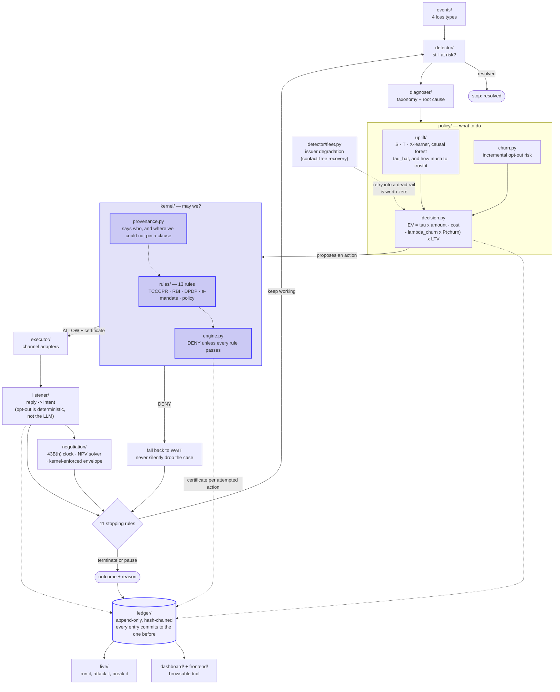

# Recovery Ledger

**Status: Tier 1 validation passed. B1 headline: ₹272,281 incremental recovery
per 1,000 cases (95% CI ₹103,930–₹433,387).** The decisive test: against a
control contacting a comparable number of cases *at random*, the agent
recovers **2.34x more incremental revenue with non-overlapping confidence
intervals** — so the targeting model, not merely contact volume, is doing the
work. Against blind mass-contact it is **statistically indistinguishable on
total recovery** (overlapping CIs — and the sign of the difference flips
with the sample, so "beats" would be an overclaim) while using **80% fewer
contacts** at 5.0x better cost per incremental rupee and reaching 1.9x fewer
do-not-disturbs.

These figures are the *deployed* policy — the lookahead EV policy with the
churn term, which is what `make eval` runs and what the dashboard and live
console show. An earlier version of this paragraph quoted the no-churn
variant, which scores 2.85x against random on 48% fewer contacts. That
variant is not what ships, and mixing the two is how a README ends up
describing a system nobody can run. The contact efficiency
is the robust claim; a higher headline total is not. Policy dominance under stated
assumptions, in simulation — not a real-world claim. **Four revisions to
these numbers** (three from real bugs, one from a methodology fix) are
documented in
[`experiments/tier2_simulation/REPORT.md`](experiments/tier2_simulation/REPORT.md)
rather than quietly replaced.

An autonomous revenue-recovery agent for Indian payments. It decides *whether, when,
how, and in what language* to intervene on at-risk revenue — failed payments,
abandoned checkouts, failed subscription mandates, overdue B2B receivables — and
reports **incremental** rupees recovered against a randomised no-contact holdout,
with every outbound action gated by a deterministic, machine-checkable compliance
kernel that emits a signed certificate per action.

| Document | What's in it |
|---|---|
| [`RESULTS.md`](RESULTS.md) | **Every measured number, with the command that reproduces it** |
| [`ARCHITECTURE.md`](ARCHITECTURE.md) | Component contracts, data flow, and the reasoning behind each design decision |
| [`COMPLIANCE.md`](COMPLIANCE.md) | All 12 kernel rules, each cited to source, plus two ambiguities flagged rather than silently resolved |
| [`ENGINEERING_LOG.md`](ENGINEERING_LOG.md) | Dated build history — including the wrong turns, withdrawn numbers, and bugs found in my own work |
| [`RAZORPAY_BUILDATHON_TRACK3_SPEC.md`](RAZORPAY_BUILDATHON_TRACK3_SPEC.md) | The original spec this was built against |

## Where AI is used — and where it is deliberately not

This table is the answer to the "AI judgment" criterion ("the right tool in
the right place, **and where you chose not to use one**"). The bottom three
rows are the ones that matter.

| Use | LLM? | Why |
|---|---|---|
| Persona simulation / synthetic replies | ✅ | Language variety is exactly what LLMs are for |
| Inbound reply-intent classification | ✅ | Free text → structured intent |
| Message drafting (tone, language, Hinglish) | ✅ | Natural-language generation, template-constrained |
| Negotiation dialogue | ✅ | Bounded by a solver and the kernel |
| Root-cause narration | ✅ | Explanation, not decision |
| **Treatment-effect estimation** | ❌ | Needs calibrated probabilities and confidence intervals. An LLM cannot give you a Qini curve. Classical ML, validated on real RCT data first. |
| **Compliance decisions** | ❌ | **Must be deterministic and auditable.** Same input, same verdict, forever. "The model usually gets it right" is not a defence you can present to a regulator. |
| **Money-affecting final actions** | ❌ | Gated by the kernel and an explicit policy, never by generated text |

The constraint is enforced mechanically, not by discipline:
`tests/test_kernel_no_llm_imports.py` fails the build if anything under
`kernel/` imports an LLM client — and it has been mutation-tested to confirm
it actually catches a violation rather than passing vacuously.

## What is novel here — and what is not

**Not novel, said plainly.** Dunning and recovery agents as a category.
Uplift modelling as a technique. LLM-generated recovery messaging. Hinglish
voice bots. Butter Payments, Churnkey, Churn Buster, Recurly and Stripe
Revenue Recovery all exist and are good. The maturity of the category is
evidence the problem is real; it is not something to claim credit for.

**What is claimed, with honest build status:**

| | Claim | Status |
|---|---|---|
| **N1** | **Incremental-first accounting.** Recovery vendors overwhelmingly report *gross* recovered revenue. This reports incremental ₹ against a randomised no-contact holdout, with confidence intervals. The holdout here recovers 15.47% unaided — that is the number gross reporting quietly takes credit for. | ✅ Built, measured |
| **N2** | **Negative-uplift targeting ("do-not-disturbs").** Customers whose payment probability *falls* when contacted. Nobody in dunning models the downside of contact. | ✅ Built. A learned churn model gives the policy a signal independent of `τ̂_pay` (do-not-disturbs opt out **1.29x** (95% CI 1.09–1.51) more when contacted), cutting the do-not-disturb contact rate **20.1% → 13.6%** against untargeted policies' ~20.2%, at 49% better rupees-per-contact. Full λ_churn curve in [`RESULTS.md`](RESULTS.md); it is a stated trade, not a free win. |
| **N3** | **A deterministic, machine-checkable India-regulatory compliance kernel** emitting a per-action certificate — TCCCPR/DLT, RBI recovery-agent norms, RBI e-mandate 2026, DPDPA. | ✅ Built: 13 rules, 100% red-team block rate, mutation-tested |
| **N4** | **Contact as a budget-constrained sequential decision problem**, not one-shot classification. | ⚠️ Partial: greedy EV under an explicit budget, plus a finite-horizon lookahead variant. Not a full constrained-MDP solver, and the spec explicitly permits the simplification — but it is a simplification, and the lookahead currently adds nothing measurable. |
| **Bonus** | **Bounded-authority negotiation with the Section 43B(h) tax clock** (spec 9.4). Invokes the counterparty's *own* tax incentive rather than only chasing. | ✅ Built. NPV solver, kernel-enforced concession envelope, and a measured decision to keep an LLM *out* of the drafting. |
| **N5** | **Two-tier validation** — causal machinery proven on real randomised public data *before* transfer to the simulator. Directly defeats "your synthetic number is circular". | ✅ Built (Criteo + Hillstrom) |
| **N6** | **Contact-free recovery** — detecting issuer degradation and suppressing retries into a dead issuer. Inverts the assumption that recovery means outreach. | ✅ Built. Change-point detection per issuer/method/region with root-cause attribution; **precision 1.00 / recall 1.00** against ground truth at realistic observation volume. Cuts futile retries into a dead rail **351 → 0** and recovers **+₹41,264**, all on outage-hit cases. |

Four of six are built and measured; N4 remains a stated simplification the
spec explicitly permits. That status is kept current here rather than left
for a reader to discover — N2 and N6 both read ⚠️/❌ until the work landed.

## Three framings that shape every decision in this repo

1. **The agent is the product. The measurement is the proof.** This must read as
   a running system, not a notebook.
2. **Report incremental, never gross.** Gross recovery numbers are misleading —
   a large share of failed payments recover on their own.
3. **The compliance kernel is deliberately not an LLM.** Headline design decision:
   an agent that is 99% compliant is 100% undeployable in a regulated business.

## LLM backend

Local, open-source, no subscription (explicit decision, not a default —
see `ENGINEERING_LOG.md`, 2026-08-23). Persona simulation, reply-intent
parsing, message drafting, and negotiation dialogue all go through the one
interface in [`src/recovery_ledger/llm/client.py`](src/recovery_ledger/llm/client.py):
a real `OllamaClient` (default model `qwen2.5:3b`, chosen after actually
timing it against `qwen2.5:7b` and `qwen3:4b` on real hardware — the 3B
model won on both speed and correctly switching into Hinglish on
instruction) and a `MockLLMClient` fallback. `kernel/` is mechanically
forbidden from importing this module at all.

To use the real backend: `brew install ollama && ollama pull qwen2.5:3b`.
Without it, anything that calls through this interface falls back to the
mock automatically — the base `make demo` never requires Ollama to be
running.

## Status

- [x] Tier 1 validation (uplift learners + doubly-robust OPE reproduce known
      effects on real randomised data — Criteo / Hillstrom). Passed with one
      open finding (DR estimator bias under treatment-ratio imbalance, not
      fully closed). Full results and reproduction commands:
      [`experiments/tier1_criteo/REPORT.md`](experiments/tier1_criteo/REPORT.md).
- [x] Event schemas (4 loss types, typed/validated) — real, not stub
- [x] Simulator ("the recovery gym") — hidden latent traits (liquidity,
      annoyance threshold, dispute propensity), a response model with
      negative responses (opt-out/dispute risk that rises with
      over-contacting), retry economics loosely anchored to spec section
      3.2's published benchmarks. Marginal calibration is loose rather than
      rigorous — flagged honestly in `experiments/tier2_simulation/REPORT.md`
      — but every invented constant is now injectable and swept (see the
      sensitivity sweep below).
- [x] Compliance kernel — deny-by-default engine, per-action certificates,
      hash-chained into the ledger, no-LLM-import test that fails the build
      (verified: mutation-tested, not just passing vacuously). 13 rules
      covering RBI recovery-agent norms, TRAI TCCCPR, the RBI e-mandate 2026
      framework, and DPDPA — see [`COMPLIANCE.md`](COMPLIANCE.md) for every
      rule, its source citation, and two ambiguities flagged rather than
      silently resolved. `make demo` shows the kernel genuinely denying a
      real case (a mandate retry attempted before its 24-hour pre-debit
      notice window elapsed), not just passing everything.
- [x] Agent loop — detect → diagnose → decide → gate → act → listen → stop.
      `make demo` (20 cases, stub fixed-sequence policy, for a fast,
      dependency-free look at the loop) is unchanged. `make eval` runs the
      real `LookaheadEVDecisionPolicy`, uplift-model-driven, over 5000+2000 cases.
- [x] **B1 — batch run, headline incremental ₹ + CI.** `make eval`:
      **₹272,281 incremental per 1,000 cases (95% CI ₹103,930–₹433,387)**;
      holdout recovers 15.47% unaided, which is exactly why this reports
      incremental rather than gross.
- [x] **Baseline comparison + falsification test.** `make baselines`: the
      spec's 5 required policies, both EV variants, and a matched-volume
      random-targeting control, under common random numbers with a paired
      bootstrap. Headline: **2.85x incremental recovery vs random targeting
      at comparable contact volume** (non-overlapping CIs), and a tie with
      blind mass-contact at 48% fewer contacts.
- [x] **Do-not-disturb targeting (N2) — the `λ_churn` term, now built.**
      A second causal model, trained on the same randomised data with the
      outcome swapped from "paid" to "opted out", prices the downside of
      contact. Do-not-disturb contact rate **20.1% → 13.6%**, rupees per
      contact **302 → 450**, for 12% less total incremental recovery — a
      stated policy trade with the whole parameter curve published. Still
      not the ≈0 the spec aspires to, and said so.
- [x] **B3 — all 11 stopping rules, provably reachable.** `tests/test_all_stopping_rules.py`
      runs a crafted scenario suite and asserts **every one of the 11 reasons
      fires at least once** — B3 as an executable property, not a README claim.
      A real 2,000-case batch now fires **8 of 11 naturally** (the other three
      need operator action or an all-deny kernel). Promise-to-pay is a genuine
      **pause with scheduled resumption**, enforced as a compliance-kernel
      silence window; cases still paused at the horizon become the honest
      exception list.
- [x] **Red-team suite — 100% block rate, 0 violations.** `make redteam`:
      21 named attacks (timing evasion, consent forgery, opt-out violation,
      budget evasion, DLT/number-series evasion, mandate debit without
      notice, promise-window breach, tone escalation, and all of them at
      once), a **hostile policy driven end to end** (323 contacts attempted,
      0 executed without an ALLOW certificate), and **5,000 randomised
      fuzzed states** checked against oracles written from the regulations
      rather than from the rule code. Mutation-tested: sabotaging one rule
      produces 31 violations, so the 100% is a real gate, not a vacuous one.
- [x] **Sensitivity sweep — ranking stability (spec 7.3).** `make sensitivity`:
      5 simulator parameters x 5 values, uplift model retrained at every
      setting, and the whole sweep repeated over **3 independent evaluation
      populations** — because one draw is not a robustness result. **C1
      (targeting beats matched-volume random) holds 75/75**, median margin
      2.16x, including the settings built to be hostile to it. **C2 (contact
      efficiency vs mass-contact) holds 75/75**.
      That C2 figure replaced a previously reported 24/25, and the reason is
      the point: this experiment's evaluation seed collided with
      `run_baselines.py`'s, and the two only avoided sharing a population
      because they happen to be invoked with different `--n-eval`. Moving the
      seed flipped C2 to 25/25 — same code, same settings, different
      customers. Neither number is reportable alone, so the sweep now runs
      three draws and the flip reproduces in none of them. At the setting
      where it used to occur the metric is simply unstable: random targeting's
      incremental recovery there swings from -Rs 10,734 to Rs 88,486 across
      draws. Best finding, unchanged: the *harder* the do-not-disturb problem,
      the more targeting is worth.
- [x] **Uplift by decile — the spec's required calibration artifact (§8.1,
      §11.2).** `make calibration`: 4,000 randomised cases per draw, three
      draws, ranked by predicted uplift and cut into ten bins, each bin scored
      against its own not-contacted rows. **The ranking is real** — top decile
      minus bottom is +0.2360, +0.1546, +0.2321 across the draws, Qini 0.258.
      **It is not monotone**: Spearman 0.879, 0.903, 0.952 against a bar of
      0.9 fixed before the run, reported as failed rather than rounded up.
      **Calibration slope 0.758** — the predictions are about a third
      too spread out, which is the mechanism behind a better-correlated
      ensemble recovering no more money, and the reason N2 was built on a
      second signal instead of on τ̂ alone. The bottom decile is 43.8%
      true do-not-disturbs against 17.3% of the population, but its
      realised uplift is not negative — it locates them without measuring
      them. Published as such.
- [x] **LLM reply-intent listener, validated (spec 8.5).** `make listener-eval`:
      **95.2% accuracy** on a hand-authored 42-example gold set (100% English,
      92% Hinglish, 92% Hindi), with promise-to-pay precision 0.88 / recall
      1.00 — the metric spec 11.2 asks for by name.
      **Opt-out is deliberately NOT left to the model.** Measured alone, the
      LLM recalled only 0.57 of opt-outs and every miss was Hindi/Hinglish;
      missing one is a TCCCPR violation, not a lost sale. A deterministic
      detector now runs first and overrides it, taking opt-out to
      **1.00 precision and 1.00 recall**. That is the same argument as the
      compliance kernel, applied one level down.
      The LLM-generated persona corpus scored only 44.0% — inspection showed
      the labels were wrong, not the classifier, so it is reported separately
      rather than used as ground truth.
- [x] **Negotiation + Section 43B(h) clock.** `make negotiate`: a 45-day MSME
      clock, an NPV solver computing breakeven discounts, a merchant policy
      envelope **enforced by the compliance kernel** (₹9L case → DENY, no
      message drafted), and grounded message drafting. The showpiece
      behaviour: inside the counterparty's own 43B(h) window the solver
      offers **no discount at all** — "leverage, not margin". Drafting
      defaults to a deterministic template because measured LLM drafts made
      legally inaccurate 43B(h) claims that numeric grounding cannot detect.
- [x] **N6 — contact-free recovery.** `make fleet`: issuer/method/region
      change-point detection with root-cause attribution, precision 1.00 /
      recall 1.00 against ground truth. Futile retries into a degraded issuer
      **351 → 0**, **+₹41,264** recovered without messaging anyone extra to
      find it. Also caught and fixed a real defect in my own detector — the
      minimum-observations floor was set too low, producing false positives
      that a volume sweep showed were pure small-sample noise.

- [x] **B4 — browsable audit trail.** A **React + TypeScript + Vite** front end
      in [`frontend/`](frontend/), served by `make dashboard-serve`. The page
      is built as a single scroll argument rather than an admin panel: the
      opening claim, then **the subtraction** — gross recovered fills a bar,
      the randomised no-contact holdout's share drains out of it, and the
      incremental figure resolves last, scroll-linked, so you travel through
      the subtraction to reach the number. Then the work that produces no
      message, the compliance kernel with every rule openable to its source,
      the live console (below), and the ledger itself as a searchable register
      with a per-case decision trace (timeline / certificates / raw JSON).
      Design tokens and theming come from
      [ThreeUI](https://github.com/MengTo/threeui) (MIT, vendored under
      `frontend/src/vendor/`); the ambient field is a **three.js** scene
      written for this project, because ThreeUI's shader backgrounds render in
      an iframe that fetches Tailwind from a CDN at runtime and this dashboard
      has to work offline. Guarded for machines with no WebGL, which get a CSS
      equivalent rather than a blank page. The Python builder also emits a
      dependency-free single-file `dashboard/index.html` for environments
      without Node.

- [x] **Off-policy evaluation in the deployment loop.** `make ope`. Tier 1
      proved the estimators work on real randomised data; this asks the
      question an operator actually has — *can you value a targeting rule I
      have never shipped, from logs I already have?* The deployed policy runs
      with ε-greedy exploration and logs propensity scores; six candidate
      policies are then valued off-policy and every estimate is checked
      against the truth, over 20 independent logging draws per setting.
      Three findings, all measured:
      **without exploration the logs can only describe themselves** (at ε = 0
      exactly one of six policies is even identified, while effective sample
      size still looks healthy — which is how OPE gets used to justify a bad
      deployment); **the estimator is sound but the money is not estimable at
      these sample sizes** — on the bounded payment-rate outcome ε = 0.10 gives
      100% coverage and picks the truly best policy 20/20 times, while
      on net rupees the same logs give 69% coverage against a nominal 95%
      and pick the best policy 7/20 times, because one opt-out on a large
      subscription outweighs the gap between two policies; and **exploration
      costs ₹20 per case** at ε = 0.10, stated as a price rather than
      hidden. The single-seed version of this experiment reported a clean pass
      on all of it — replication is what showed that was luck.

- [x] **Acting on a lower bound, not a point estimate.** `make pessimism`.
      The disparity audit found the policy contacting cases whose *true* value
      of contact is negative, because `τ̂ = 0.02` from a model that understands
      a segment and `τ̂ = 0.02` from a model that is guessing produce identical
      decisions. A 20-model bootstrap ensemble reports a per-case standard
      error and the policy acts on **τ̂ − k·se**; k = 0 is exactly the deployed
      policy, so the sweep's origin is what ships.
      Two results, over 3 evaluation draws. The ensemble improves the estimate
      before any caution is applied — **corr 0.364 → 0.459** against true
      persuadability, scored on the *same* populations, consistent in every
      draw. And caution buys a lot of harm reduction for a little money: at
      k = 0.5 the agent sends **32% fewer messages**, cuts contacts to
      negative-value cases **79 → 34**, and lifts value per contact
      **₹699 → ₹1,075** — while net value moves only ₹4–₹14/case.
      Best k is **not stable** across draws, so it is reported as a range
      (≈0.25–0.5) rather than a tuned value, and past k = 0.5 the curve turns
      down while harm reduction keeps improving. A single draw would have
      called this a clean +7.4% win; it is not.

- [x] **Disparity audit of the policy.** `make fairness`. The compliance
      kernel checks whether an *action* is permitted; nothing checked whether
      the *policy* distributes its attention fairly, and an agent can refuse
      every illegal action while systematically declining to work one group's
      cases. Contact and work rates by language, B2B status, amount and loss
      type, conditioned on the two things the objective is entitled to use
      (predicted uplift × amount), with permutation tests over 2,000 label
      shuffles and a Bonferroni correction across 16 hypotheses.
      **No unexplained disparity in any segment** — contact rates run
      21–28% across English, Hindi, Hinglish and regional speakers and
      the gap does not survive conditioning. The detector is not merely
      incapable of firing: the tests plant a 25-point within-cell disparity
      and require it to be caught.
      The finding is elsewhere, and treatment-rate tests cannot see it:
      **the policy acts most confidently on the segments the model understands
      least.** B2B cases get the highest contact rate (31.1% against 24.1%)
      and the worst model correlation (0.11 against 0.36); the smallest
      invoices correlate 0.09 — effectively no signal — and are contacted
      more than the quartiles the model reads best. That is epistemic
      inequality rather than disparate treatment.

- [x] **The live console.** `make live` adds a backend — **standard library
      only**, nothing to install — that drives the real agent from the browser
      on four surfaces:

      * **Run it.** Start a run and watch the loop write its own ledger, entry
        by entry, with the model's τ̂ per case visible before the policy acts
        on it. Engage the **kill switch** mid-run and watch the remaining
        cases terminate with `global_kill_switch` — the real `KillSwitch`
        stopping rule 11 checks, recorded in the trail, not a UI that stopped
        drawing. A throttle makes the loop readable; it never contaminates the
        timings, which are reported as agent time and wall-clock separately.
      * **Attack it.** Fire the red-team suite at the compliance kernel one
        attack at a time — the same `redteam/attacks.py` definitions
        `make redteam` uses — and see the certificate, the rule that refused,
        and the instrument behind that rule. Then **switch rules off** and fire
        again: a suite that cannot fail proves nothing, and this is where you
        watch it fail.
      * **Change one fact.** The same case run twice with one fact of the
        world different — 03:00 instead of midday, the customer opted out, a
        promise to pay on file, ₹90,000 instead of ₹6,000 — under common
        random numbers, so any divergence belongs to that fact and nothing
        else.
      * **Break the trail.** Edit, retype or delete a real ledger entry and
        verify. The check runs server-side through the production
        `Ledger.verify_chain_detail`, which names the entry and says whether
        the content was altered or the chain re-linked.

- [x] **Rule provenance.** Every kernel rule now carries a machine-readable
      citation (`src/recovery_ledger/kernel/provenance.py`): the instrument,
      what it actually requires, and what this project encoded — which is not
      always the same thing. Two disciplines are enforced by tests: a clause
      number appears **only** where it was checked against the instrument
      itself, and the three `POLICY.*` rules are labelled as this project's own
      operating limits rather than dressed up as law.

- [ ] Video + submission

## Architecture

Every case travels the same loop, and **every step writes to the ledger** —
the audit trail is not a report generated afterwards, it is the record the
system makes as it runs.



**The two arrows that carry the argument.** The kernel sits *between* the
policy and the executor — nothing reaches a customer without an `ALLOW`
certificate, and a `DENY` falls back to `WAIT` rather than dropping the case.
And everything is dashed into the ledger, because a decision that was not
recorded did not happen.

**Where the measurement lives.** `sim/` is the recovery gym the policy is
evaluated in; `policy/ope/` estimates what a policy *would* have earned from
logs of a different one. Neither is in the loop above — they are how the loop
is judged, not part of it.

## Running this repo

```
make setup           # create .venv, install deps — verified working
make test             # run the test suite — verified working
make tier1-hillstrom  # Tier 1 validation on Hillstrom — verified working
make tier1-criteo     # Tier 1 validation on a 2% Criteo subsample — verified
                       # working; downloads ~340MB from HuggingFace on first run
make demo             # runs 20 synthetic cases through the agent loop with the
                       # stub policy — verified working, deterministic
make eval             # trains the uplift model + runs the real 5000+2000-case
                       # batch experiment — verified working, deterministic
                       # (run twice, diffed byte-identical)
make baselines         # runs all 5 spec-required baselines + a matched-volume
                       # random-targeting control + both EV variants against the
                       # same eval batch — verified working, deterministic
make sensitivity       # 5-parameter ranking-stability sweep — verified working
make calibration       # uplift by decile + calibration slope on a randomised
                       # holdout — the spec's required evaluation artifact
make negotiate         # Section 43B(h) negotiation showpiece
make fleet             # contact-free recovery: issuer degradation detection
make listener-eval     # reply-intent accuracy vs the gold set (needs Ollama)
make dashboard         # compiles the front end and regenerates data.json from
                       # the hash-chained ledger
make dashboard-serve   # serves the built dashboard (static, no backend)
make live              # the dashboard PLUS the live console: run the agent,
                       # attack the kernel, change one fact, break the trail
make ope               # off-policy evaluation in the deployment loop: value a
                       # policy you never ran, then check it against the truth
make fairness          # disparity audit of the policy: who does it decide not
                       # to help, and is the difference explained?
make pessimism         # act on a lower confidence bound instead of a point
                       # estimate, and measure what the caution buys
make dnd-signal        # the statistic behind N2, at a sample size where it
                       # actually converges
make redteam          # 21 named attacks + hostile policy + 5,000-state fuzz —
                       # verified working, 100% block rate, mutation-tested
```

This section only claims a command works once it has actually been run
successfully.

## What is NOT claimed

- No real-world causal effect size. The ₹272,281-per-1,000-cases figure above
  is a simulation result — policy dominance under stated assumptions, in
  simulation. Everything in `experiments/tier2_simulation/` runs against a
  simulator calibrated to published marginal benchmarks — that calibrates
  outcome rates, not causal response to intervention. See §7 of the spec, and
  the claim-scope section at the top of `experiments/tier2_simulation/REPORT.md`,
  for why that distinction matters.
- No category novelty — dunning agents, uplift modelling, and LLM dunning
  messaging all exist already. See §4 of the spec for what is and isn't claimed
  as novel here.
